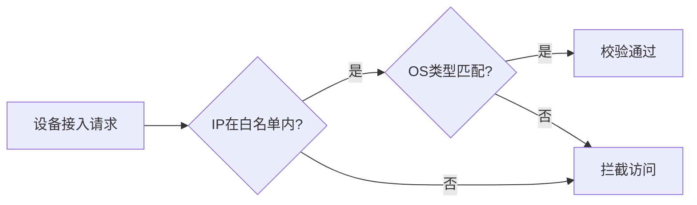
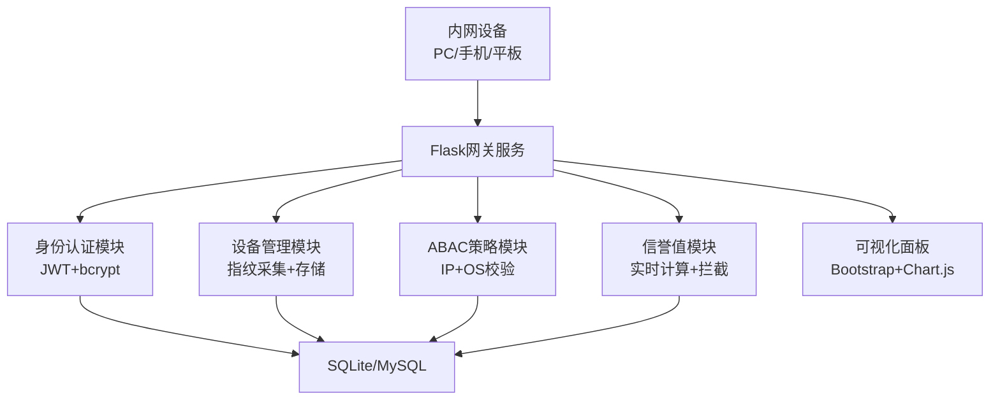

# ZeroTrustDeviceAuth


轻量级内网移动设备零信任认证系统，遵循「永不信任，始终验证」核心理念，通过设备指纹、ABAC 策略、动态信誉值三重防护，保障内网资源安全接入。

## 📋 项目简介

针对企业 / 家庭内网移动设备接入风险，本系统提供从设备合法性校验到访问权限动态管控的全流程解决方案，无需复杂部署即可实现：

* 设备身份唯一标识（基于硬件特征 + 网络属性）

* 细粒度访问控制（IP 网段 + 设备类型双重校验）

* 动态安全基线（信誉值实时评估与违规拦截）

* 操作行为审计（全流程日志记录与追溯）

## 🎯 核心功能

### 1. 设备身份认证

* 自动采集设备指纹（型号、IP、浏览器特征）

* 支持 Windows/macOS/Android/iOS 多设备识别

* 设备信息加密存储，防篡改校验

### 2. ABAC 策略控制



### 3. 动态信誉值体系

| 行为类型 | 信誉值变化 | 触发阈值    | 处理动作         |
| ---- | ----- | ------- | ------------ |
| 正常操作 | +10 分 | ≥70 分   | 保持访问权限       |
| 异常登录 | -30 分 | 30-69 分 | 二次验证         |
| 违规操作 | -50 分 | <30 分   | 强制登出 + IP 封禁 |

### 4. 可视化管理面板

* 设备状态实时展示（在线 / 离线、信誉值评分）

* 操作日志分类检索（按设备 / 时间 / 行为类型）

* 策略配置可视化界面

## 🚀 快速开始

### 1. 环境准备

#### 硬件要求

* 部署服务器：CPU ≥ 2 核，内存 ≥ 2GB

* 测试设备：PC / 手机 / 平板（支持主流浏览器）

#### 软件依赖

```
\# 克隆仓库

git clone https://github.com/\[你的用户名]/ZeroTrustDeviceAuth.git

cd ZeroTrustDeviceAuth

\# 创建虚拟环境

python -m venv venv

\# Windows激活

venv\Scripts\activate

\# Mac/Linux激活

source venv/bin/activate

\# 安装依赖

pip install -r requirements.txt
```

### 2. 配置初始化

1. **复制环境变量模板**

```
cp examples/.env.example .env
```

1. **编辑核心配置**（.env 文件）

```
\# 系统密钥（建议使用openssl rand -hex 16生成）

SECRET\_KEY=your\_secure\_random\_key

\# 数据库配置（默认SQLite，支持MySQL替换）

DATABASE\_URI=sqlite:///zero\_trust.db

\# 策略参数

IP\_WHITELIST=192.168.1.0/24  # 替换为你的内网网段

REPUTATION\_THRESHOLD=70      # 信誉值最低阈值

CALCULATE\_INTERVAL=30        # 信誉值计算周期(秒)
```

1. **初始化数据库**

```
python init\_db.py
```

### 3. 启动服务

```
\# 开发环境

python zero\_trust/app.py

\# 生产环境（推荐）

gunicorn -w 4 -b 0.0.0.0:5000 zero\_trust.app:app
```

> 启动成功提示：
>
> `Running on all addresses (`
>
> `0.0.0.0:5000`
>
> `)`

### 4. 访问系统

| 设备类型    | 访问地址                                           | 测试账号           |
| ------- | ---------------------------------------------- | -------------- |
| 部署服务器本地 | [http://localhost:5000](http://localhost:5000) | test1/123456   |
| 内网 PC   | http://\[服务器内网 IP]:5000                        | admin/admin123 |
| 内网手机    | http://\[服务器内网 IP]:5000                        | test2/654321   |

## 🧪 内网测试指南

### 测试前置条件

1. 所有设备连接**同一局域网**（验证方法：`ping 服务器内网IP`通连）

2. 临时关闭服务器防火墙（测试后需重启）：

* Windows：控制面板→系统和安全→Windows Defender 防火墙→关闭

* Linux：`sudo ufw disable`

1. 确认服务监听配置（app.py）：`host='``0.0.0.0``'`

### 核心测试场景

#### 1. 基础接入测试

| 步骤 | 操作内容                  | 预期结果               |
| -- | --------------------- | ------------------ |
| 1  | 内网 PC 访问系统地址          | 显示设备校验页面           |
| 2  | 输入设备型号「Windows 11 PC」 | 提示「校验通过，跳转登录」      |
| 3  | 输入账号 test1/123456     | 进入管理面板，显示信誉值 100 分 |

#### 2. 策略拦截测试

| 测试场景  | 操作方法                  | 预期结果                                              |
| ----- | --------------------- | ------------------------------------------------- |
| 跨网段访问 | 测试设备连接 192.168.2.x 网段 | 提示「设备不合法（IP / 类型不符）」                              |
| 非授权设备 | 手机输入「Android Phone」   | 拦截访问，控制台输出`is_ip_in_range: True, os_match: False` |

#### 3. 信誉值联动测试

1. 登录后执行 2 次「违规操作」

2. 等待 30 秒（计算周期）

3. 预期：自动弹窗提示重认证，数据库`current_reputation`字段为 0

### 常见问题排查

| 问题现象          | 排查步骤                                                                | 解决方案                                                |
| ------------- | ------------------------------------------------------------------- | --------------------------------------------------- |
| 无法访问网站        | 1. ping 服务器 IP2. telnet 服务器 IP 5000                                 | 1. 检查网络连接2. 关闭防火墙3. 重启 Flask 服务                     |
| 校验失败但 IP 在白名单 | 1. 编辑 device\_utils.py，添加`print(device_attrs)`2. 重启服务查看 os\_type 字段 | 1. 确认设备型号输入正确2. 调整 OS 识别逻辑                          |
| 信誉值不更新        | 1. 查看控制台线程日志2. 检查 CALCULATE\_INTERVAL 配置                            | 1. 确保`start_reputation_calculator()`执行2. 验证数据库提交无报错 |

## 🔧 技术架构

### 系统架构图



### 技术栈详情

| 模块    | 技术选型         | 版本要求    |
| ----- | ------------ | ------- |
| 后端框架  | Flask        | 2.3.3+  |
| 数据库   | SQLite/MySQL | 3.36.0+ |
| 身份认证  | PyJWT        | 2.8.0+  |
| 密码加密  | bcrypt       | 4.0.1+  |
| 前端 UI | Bootstrap    | 5.2.3+  |

## 📈 功能扩展

### 推荐扩展方向

1. **多因素认证**：集成 pyotp 实现谷歌令牌验证

2. **设备安全检测**：接入 SDK 检测 Root / 越狱状态

3. **日志分析**：添加 ELK 栈实现操作日志集中分析

4. **告警通知**：配置邮件服务发送信誉值过低告警

### 扩展开发示例（多因素认证）

```
\# 安装依赖

pip install pyotp

\# 在models.py添加字段

class User(db.Model):

&#x20;   # 原有字段...

&#x20;   totp\_secret = db.Column(db.String(16))

\# 生成令牌

import pyotp

totp = pyotp.TOTP(pyotp.random\_base32())

user.totp\_secret = totp.secret

db.session.commit()
```

## 🤝 贡献指南

### 提交规范

* 分支命名：`feature/功能名称`、`bugfix/问题描述`

* 提交信息：`类型(模块): 描述内容`（例：`feat(auth): 添加短信验证码功能`）

### 协作流程

1. Fork 本仓库

2. 创建特性分支（`git checkout -b feature/xxx`）

3. 提交修改（`git commit -m 'feat: xxx'`）

4. 推送分支（`git push origin feature/xxx`）

5. 创建 Pull Request（附功能说明 + 测试报告）

### 开发规范

* 代码风格：遵循 PEP8 规范，使用 pylint 检查

* 测试要求：核心功能需编写 pytest 测试用例

* 文档更新：新增功能需同步更新 README 与架构图

## 📄 许可证

本项目基于**MIT 许可证**开源，详见[LICENSE](LICENSE)文件。

## 📞 联系与支持

* 项目维护者：\[你的名称 / 团队名]

* 问题反馈：通过 Issues 提交（使用模板规范描述）

* 技术交流：\[邮箱地址] / \[Discord 链接]

## 📋 版本更新日志

### v1.0.0（首次发布）

* 实现设备指纹采集与 ABAC 策略控制

* 开发动态信誉值评估系统

* 支持多设备内网接入测试

> （注：文档部分内容可能由 AI 生成）
