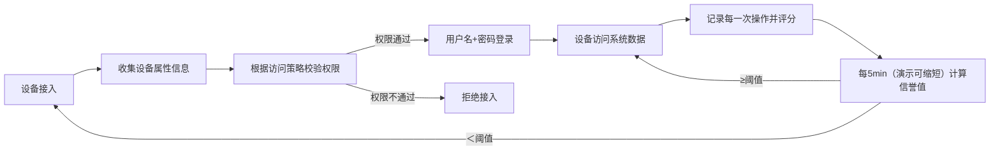

# **零信任内网移动设备接入认证系统**

## 核心技术点：**零信任架构**、**属性基访问控制（ABAC）**

### **零信任架构：“从不信任、始终验证”**

&nbsp; **始终**监控接入设备的信誉值（由操作内容、访问记录等评分分权重计算而得）

&nbsp;  始终：可以通过每隔一段合理时间进行信誉值重计算实现

&nbsp;  **信誉值**：每一次设备内网操作都会被记录在**操作日志**中，进行评分

&nbsp;   若检测到信誉值低于阈值，需要重新进行身份认证（下面的ABAC机制），将日志清空

### **ABAC：基于属性的动态访问控制**

&nbsp; 属性预先采集（**设备注册**）：可以包括设备型号、使用者、网络验证（只允许内网登录）

&nbsp;  根据采集数据生成**访问策略**

&nbsp; 接入方式：首先收集设备属性信息，根据访问策略判断是否具有访问权限（读取、修改）

&nbsp; 下一步 用户名+密码（存储在数据库中读取）（**密码最多输入3次，否则禁止访问**）

&nbsp;

&nbsp; **数据库搭建**：内容包括**用户名，对应密码**，以及采集到的**设备属性**

实现方式：python模拟企业系统，搭建数据库以及属性收集后台，**可视化实现**

&nbsp; 模拟一台合法（**不合法，触发不可接入提醒**）的pc设备接入系统，进行**一次或多次不合法操作**（如修改无权限修改文件），触发重新认证机制，用于证明系统的可行性。（这个模拟过程需要可视化进行，因此需要设计一个**完整的接入认证机制**，***最好是可以实现真机接入***）

### 四、完整接入认证机制

